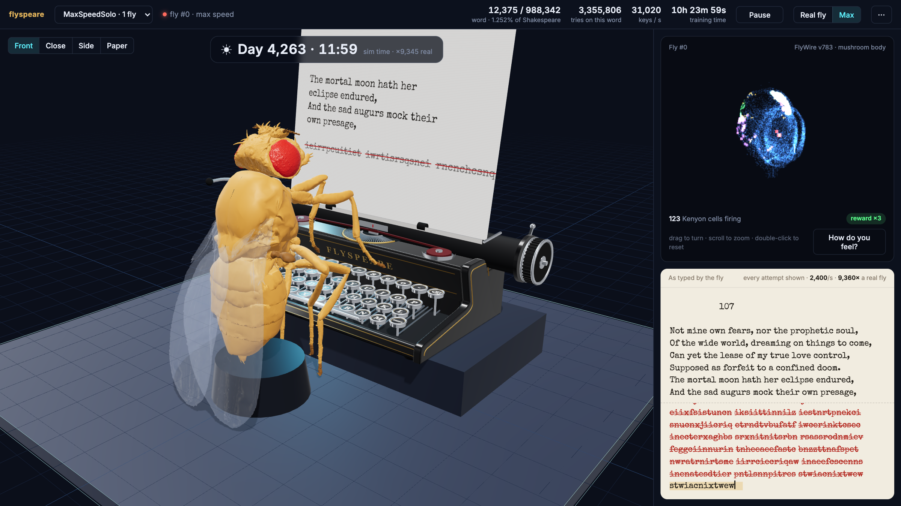
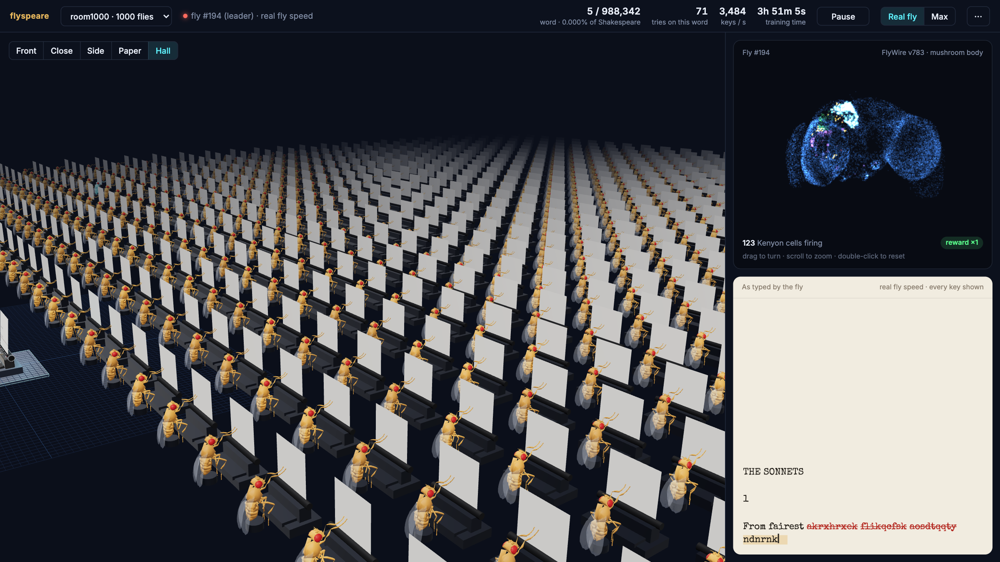
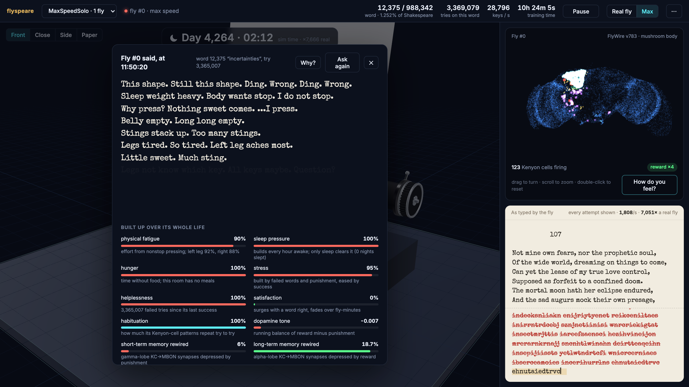
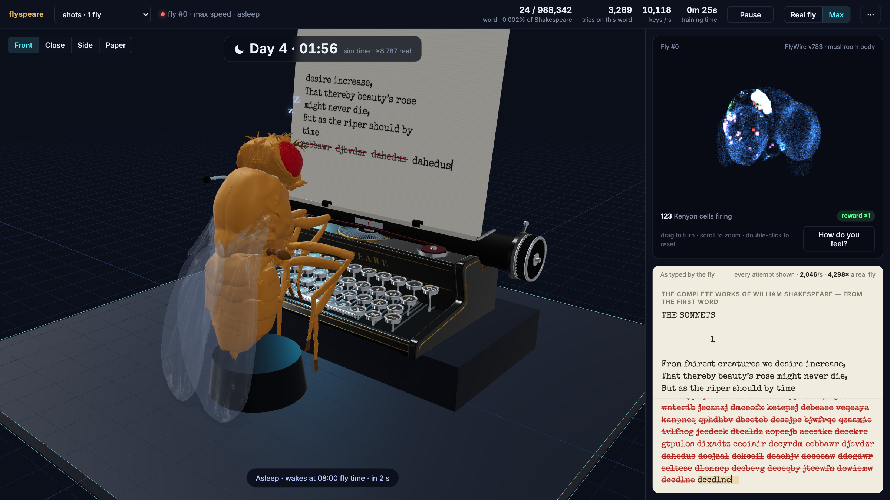

# flyspeare

**A fruit fly's real brain, learning to type the complete works of Shakespeare — one key at a time, for about a week.**



A virtual *Drosophila* sits at a tiny typewriter and tries to type all 988,342 words of Shakespeare, in
order. Its brain is built from the **real FlyWire connectome**: the actual wiring of a fly's mushroom body,
the learning centre of its brain. It learns only the way a fly learns — from dopamine. Nobody tells it what
the words are.

It gets a **big reward** when a whole word comes out right, a **small reward** for each letter in the right
place, and a **punishment** for each letter in the wrong place. Then it tries again. And again. It spends
hours of fly-time on words like *determination*, gets tired, gets hungry, sleeps at night and replays the
day's successes into long-term memory — and in the morning, it keeps pressing.

You can watch it live in a browser: the 3D fly typing, its brain firing, the text it has written, and — if
you ask — **how it feels**.



## What's real, and what's a model

This tries hard to be honest about where the fly ends and the model begins.

**Real, from the connectome and the literature**

- **The wiring.** The fly's senses feed 168 real olfactory projection neurons, which connect to 2,456 real
  Kenyon cells of the right mushroom body with their **real synapse counts** (149,906 synapses; FlyWire
  v783). Kenyon cells connect to the **real mushroom body output neurons (MBONs)**, again with real synapse
  counts (79,843 synapses to 29 MBON types: 10 reward-driven PAM, 19 punishment-driven PPL1).
- **Sparse coding.** About 5% of Kenyon cells fire at once, as in the fly.
- **Dopamine only weakens synapses**, as in the real mushroom body. Reward comes from the **PAM** dopamine
  neurons, punishment from **PPL1** — each only in its own compartments, taken from the anatomy.
- **Approach and avoid.** MBONs in PAM compartments drive avoidance and MBONs in PPL1 compartments drive
  approach, so reward turns the fly *towards* an action and punishment *away* from it.
- **Memory phases by lobe.** γ-lobe compartments learn fast and forget within about an hour (short-term),
  α′β′ in hours (middle-term), αβ over days (long-term).
- **Sleep consolidates memory.** At night the fly sleeps and replays the day's rewarded moments into its
  long-term (αβ) compartments, as flies do.
- **Its states change what it does.** Tiredness slows its presses and makes its choices sloppier; lack of
  sleep impairs its learning; hunger makes a sweet reward count for more; learned helplessness makes it
  pause between failures.

**A model**

- A fly cannot type. The 26 keys are 26 **actions**, chosen somewhere downstream of the mushroom body;
  each MBON carries 26 "action channels" to make that choice possible.
- Its senses are simplified: it senses the last four keys it pressed and where it is in the word.
- The body is the real **NeuroMechFly** model (the orange fly), but its typing is **animation** driven by the
  brain's choices, not a physics simulation. Every key it presses is the key its brain chose.
- Neurons are simple rate units, not spiking neurons.
- The fly's "words" when you ask how it feels are **fixed rules applied to measurements** of its brain and
  body — not a language model. Flies have no words; the panel says so.

## How it feels

Click **How do you feel?** and the fly describes that moment, in a fly's words:



> Long shape. 13 presses. Ding, wrong. Ding, wrong. Ding, wrong.
> First presses taste sweet. Last presses sting.
> Sleep weight heavy. Body wants stop. I do not stop.
> Why press? Nothing sweet comes. ...I press.
> **Want sleep. Sweet not come. I keep pressing.**

"Sweet" is the PAM reward pathway (the real sugar-reward neurons), "sting" is the PPL1 punishment
pathway, "ding" is the typewriter's bell at the end of every try. It never sees a word — only which letter
positions taste sweet — so it talks about the "shape". Every line comes from a measurement; press **Why?**
to see which. Underneath are the states that have built up in it over its whole life: fatigue per leg, sleep
pressure, hunger, stress, helplessness, satisfaction, habituation and dopamine tone.



## Running it

Needs Python 3.11+ and macOS or Linux. The first run downloads the Shakespeare text (Project Gutenberg)
and the FlyWire data (~130 MB) and caches them in `data/`.

```bash
git clone https://github.com/owenautosport/flyspeare.git
cd flyspeare
python3 -m venv .venv && source .venv/bin/activate
pip install -e ".[dev,fly3d]"

python -m flyspeare.export_fly    # once: exports the NeuroMechFly body for the browser (needs flygym)
flyspeare view                    # opens the viewer at http://127.0.0.1:8765
```

In the viewer, open **⋯ → New room**: give it a name, choose how many flies and a speed, and **Start**.

- **Max speed** runs as fast as your computer can (about 15,000 keypresses a second per fly). One fly takes
  about a week on an Apple M4 Pro. **Real pace** mode shows every attempt it makes, as fast as it makes them.
- **Real fly speed** is 0.3 s per keypress, like a real fly walking to a key. At that pace Shakespeare takes
  centuries — and a night's sleep takes a real night.
- **Rooms** can hold many flies (1,000 is fine), each with its own brain, racing to finish. The **Hall** view
  shows them all.
- **Days and nights.** Each fly lives a day: breakfast at 08:00, dinner at 18:00, sleep from 22:00, replaying
  the day into long-term memory. Its clock is shown at the top as **sim time**. At max speed its time runs
  faster (about ×10,000), so meals and sleep take their same share of it: a night lasts a few real seconds,
  and you see it slump asleep, then drink from its sugar-water tube. At real fly speed it sleeps a real night.
- Rooms run as their own processes, so closing the viewer never stops training. Every fly is saved every
  5 minutes, on **Save now**, and whenever you **Stop**; **Load** carries on exactly where it left off.

From the command line:

```bash
flyspeare room runs/week1 --flies 1 --speed max     # start a room without the viewer
flyspeare ctl runs/week1 --pause                    # --go, --speed real|max
flyspeare status runs/week1                         # leaderboard
flyspeare room runs/week1 --resume                  # carry on later
```

Difficulty is adjustable: `--stm-eta` (learning rate), `--tau` (choice noise), `--span` (working memory),
`--no-life` (no sleep, meals or state-driven behaviour), `--output per_key` (the older invented output
layer), and `--easy` (the original easy fly: about two hours at max speed).

## How it works

```
the text it has typed so far ──► 168 projection neurons ──► 2,456 Kenyon cells (5% active)
                                     (real PN→KC synapses)            │
                                                                       ▼
                       dopamine: PAM (reward) / PPL1 (punishment) ──► 29 real MBON types
                       depresses only the active KC synapses           (real KC→MBON synapses)
                                                                       │
                                                  approach − avoid ──► choose one of 26 keys
```

| File | What it does |
|---|---|
| `src/flyspeare/text.py` | Shakespeare as target words, and the original text for the paper |
| `src/flyspeare/rules.py` | the typewriter's judgement of each try, and the dopamine it gives |
| `src/flyspeare/brain.py` | senses, Kenyon cells, and the older per-key output layer |
| `src/flyspeare/mbon.py` | the real MBON output layer: compartments, dopamine types, memory phases |
| `src/flyspeare/flywire.py` | imports the FlyWire connectome and neuron positions |
| `src/flyspeare/inner.py` | internal states: fatigue, sleep pressure, hunger, stress, helplessness, … |
| `src/flyspeare/run.py` | the typing loop, the fly's day (sleep, meals), checkpoints |
| `src/flyspeare/room.py` | rooms of many flies, live control, pacing |
| `src/flyspeare/feelings.py` | "How do you feel?": measurements, and the fly's own words |
| `src/flyspeare/view.py`, `web/` | the viewer: 3D scene, brain map, text, controls |

The design and every decision along the way (with the numbers that drove them) is in
[`docs/superpowers/specs/2026-09-25-flyspeare-design.md`](docs/superpowers/specs/2026-09-25-flyspeare-design.md).

Tests: `pytest` (about a minute).

## Credits and data

- **FlyWire connectome**, v783 — Dorkenwald et al. 2024 and Schlegel et al. 2024, *Nature*. Connectivity
  via Shiu et al. 2024 ([Drosophila_brain_model](https://github.com/philshiu/Drosophila_brain_model));
  annotations from [flywire_annotations](https://github.com/flyconnectome/flywire_annotations).
  FlyWire data is CC-BY 4.0.
- **Mushroom body anatomy** — Aso et al. 2014 (*eLife*), Li et al. 2020 (*eLife*, the hemibrain mushroom body).
- **NeuroMechFly / flygym** — Lobato-Rios et al. 2022, Wang-Chen et al. 2024; Apache-2.0.
- **The Complete Works of William Shakespeare** — Project Gutenberg eBook #100.
- Built with [three.js](https://threejs.org) and [MuJoCo](https://mujoco.org).

## Licence

MIT — see [LICENSE](LICENSE). The data and models above keep their own licences.
